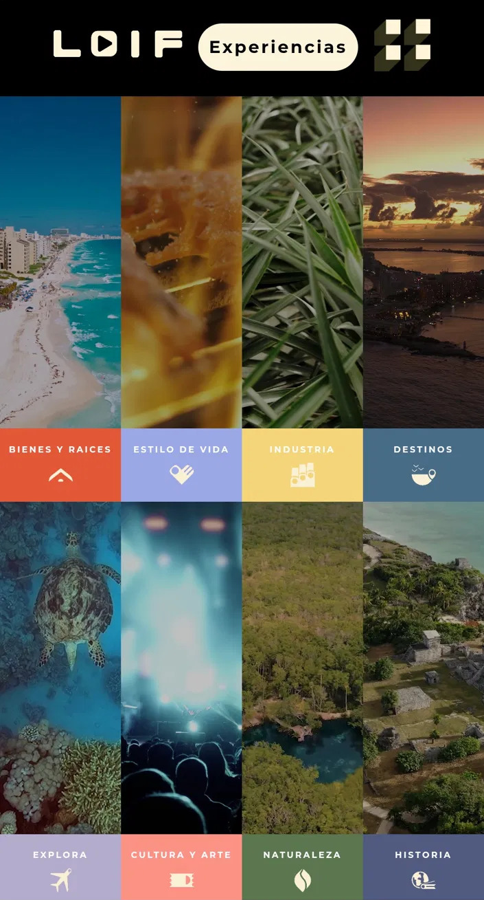
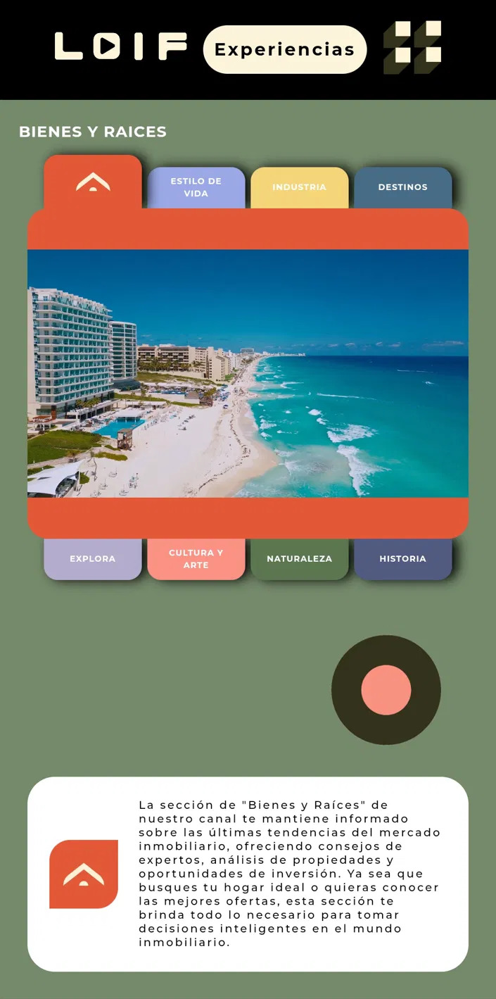
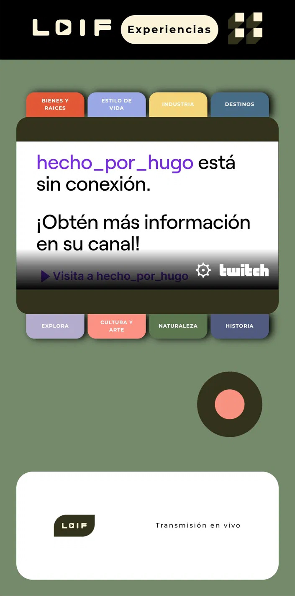

# LAIF — laif.network

Mobile-first content platform I built for a client. It works as a curated video showcase around different categories (real estate, lifestyle, destinations, nature, culture, etc.), with Twitch streams embedded for the channels that are live.

**Live site:** [laif.network](https://laif.network)



---

## What it does

The site is structured around 8 themed categories (Bienes y Raíces, Estilo de Vida, Industria, Destinos, Explora, Cultura y Arte, Naturaleza, Historia). Each one has its own video content and visual identity inside the same overall design system.

The home is a video mosaic where each tile previews a category. Tapping one expands the section with a short description and the videos that belong to it.

There's also a floating "Transmisión en vivo" button that connects directly to the brand's Twitch channel — if the channel is offline, the player shows the offline state instead of just breaking.

## Tech stack

- **SvelteKit** + **TypeScript**
- **Tailwind CSS** for styling
- **Firebase** for hosting the video assets
- **Twitch embeds** for live streaming
- Static JSON for content (no backend needed for this use case)
- Deployed on **Vercel**

## What I focused on

- **Mobile-first.** The site was designed to be used on phones first. Most of the layout decisions (the "tab card" navigation, the floating buttons, the vertical mosaic) came from that constraint.
- **Visual identity.** The client had a specific brand direction and I worked closely with them to translate it into the actual components — colors, typography, the curved card shapes, the LAIF logo treatment.
- **Performance.** Since the home loads several video thumbnails, I had to be careful with lazy loading and image optimization so it feels fast even on mobile data.
- **Twitch integration.** Embedding the player is one line, but handling the "offline" state cleanly and making it match the rest of the site's look was the actual work.

## Screenshots

| Home (video mosaic) | Category view | Twitch offline state |
|---|---|---|
|  |  |  |

## Running it locally

```bash
git clone https://github.com/polilla2802/sveltekit-laif
cd sveltekit-laif
npm install
npm run dev
```

Then open `http://localhost:5173`.

If you want to test the Firebase video embeds locally you'll need a Firebase config (`.env.local`) — there's an example in `.env.example`.

## Notes

This is a freelance project I built for an external client. The code is open here, but the content (videos, brand assets) belongs to them. If you want to see the result in action, check out [laif.network](https://laif.network) directly on your phone — it's where the design really makes sense.
